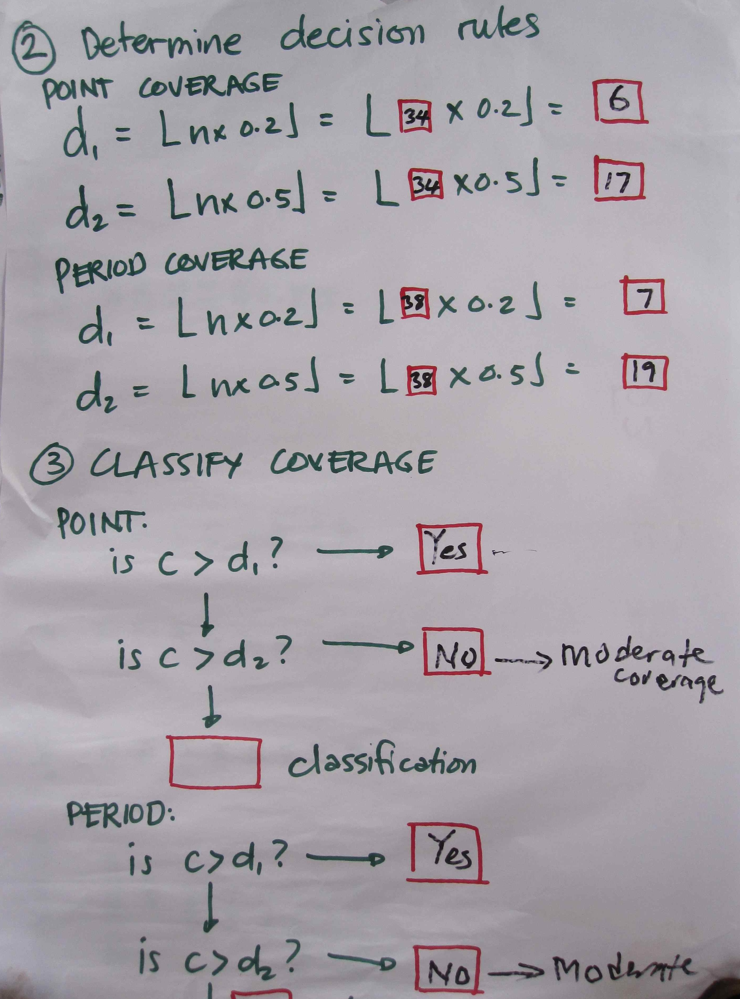

```{r setup, include=FALSE}
options(htmltools.dir.version = FALSE)
```

```{r xaringan-themer, include=FALSE, warning=FALSE}
library(xaringanthemer)
style_mono_light(
  #base_color = "#509935",
  base_color = "#000000",
  base_font_size = "22px",
  title_slide_background_color = "#FFFFFF",
  title_slide_background_image = "images/ecohealth_title_background_4by3.png",
  title_slide_background_size = "contain",
  #title_slide_text_color = "#509935",
  title_slide_text_color = "#000000",
  background_image = "images/ecohealth_slide_background_4by3.png",
  header_font_google = google_font("Fira Sans"),
  text_font_google = google_font("Fira Sans Condensed"),
  code_font_google = google_font("Fira Mono"),
  code_font_size = "0.7rem",
  text_slide_number_font_size = "1em",
  link_color = "#509935"
)
```

# Outline

* What is LQAS?

* How to perform LQAS

    - Statistical design
    - Sampling design

* Case Study: Sierra Leone National CMAM Coverage Survey

* Possible applications to One Health programmes

---

# What is LQAS?

* analytical approach for robust classification of "lots" (e.g., *set of outputs or products*, *service delivery units*, *programme areas*) based on a pre-determined standard or cut-off;

* devised and used in industry/manufacturing for performing quality assurance at minimal cost;

* adopted in health to assess prevalence of specific conditions, to assess programme quality, or to determine health care service delivery performance

* cost reduction is achieved primarily through much smaller sample size requirements.

---

# LQAS - statistical design

* LQAS is more an analysis technique than a sampling approach;

* classifies rather than estimates - answers the question:

**"How many true values do I need to find from a representative sample in order for me to determine that the whole lot is above or below a given standard?"**

---

# LQAS - statistical design

To answer this question, we need to:

* **determine standards** - should be pre-determined and should be based on either empirically verified values or agreed norms/standards

* **determine sample size** - sample size calculation is based on the 1) standards used; 2) the maximum acceptable $\alpha$ error (false positives); 3) maximum acceptable $\beta$ error (false negatives); and 4) population (to allow for finite population correction)

* These parameters will allow us to make a sampling plan to answer the earlier question:

$$ d ~ = ~ \left \lfloor{n ~ \times ~ \frac{p}{100}} \right \rfloor $$
---

class: center, middle

# LQAS - example

Assume that in the specific lot / study area, the total population is 500 individuals. We want to assess whether the prevalence of Disease X in the population is at least 50% with a maximum acceptable $\alpha$ error of 10% and a maximum acceptable $\beta$ error of 10%.

---

# LQAS - sampling plan

* Sample size - see sample size table; see http://www.brixtonhealth.com/hyperLQAS.html

* Calculate *decision rule*

$$ d ~ = ~ \left \lfloor{37 ~ \times ~ \frac{50}{100}} \right \rfloor ~ = ~ \left \lfloor{18.5} \right \rfloor ~ = ~ 18 $$

* We will need to find more than 18 cases to classify this area as having a Disease X prevalence of at least 50%

---

# LQAS - survey design

* Once you have a sampling plan, designing the survey and sampling itself will be based on any other probabilistic survey design;

* Ensure sampling units within the lot have an equal chance of being selected;

* If using cluster sampling, account for design effect;

* Can use simple random sampling, systematic random sampling, spatial sampling approaches

---

class: center, middle

# Questsions so far?

---

class: center, middle

# Case Study: Sierra Leone National CMAM Programme Coverage Survey

---

# CMAM and Sierra Leone

.pull-left[
  
* Assess the coverage of treatment programme for severe acute undernutrition (wasting) in children under 5
  
* Severe wasting is rare; up to 5% in famine situations; typical high values about 2-3% in "normal" times
  
* Team of district level health managers were trained to conduct LQAS in each of the 14 districts of Sierra Leone (the "lots")

]

.pull-right[

  .center[]

]

---

# Results - map

.pull-left[

.center[]

]


.pull-right[

* Surveys took 3-4 days per district; on last day, team was able to report immediately the results for the district

* Only 3 out of 14 districts performed moderately with a CMAM coverage of between 20% and 50%

]

---

# Results - table

.pull-left[

* Data collected from each lot can be aggregated to estimate coverage throughout the country
  
* Coverage estimate for the whole country was at 19.7% (15.7% - 23.7%)

]

.pull-right[

  .center[]

]


---

# Data system

.pull-left[

* Survey/study was simple enough that data system was mainly paper-based

]

.pull-right[

.center[]

]

---

# Analysis

.pull-left[

* Analysis approach was simple enough that it can be done at real time with results reportable as soon as the survey/study is finished

]

.pull-right[

.center[]

]

---

class: center, middle

# Questions so far?

---

# Possible applications to One Health programmes

* Pre-study assessments to aid site selection or study design

* Programme monitoring and evaluation

* Surveillance, early warning systems (?)

---

class: center, middle

# Thank you!

Slides can be viewed at https://ecohealthalliance.github.io/lqas or PDF version downloaded at https://ecohealthalliance.github.io/lqas/lqas.pdf

R scripts for slides available at https://github.com/ecohealthalliance/lqas

---

# Links to relevant LQAS references and further readings

Myatt M, Mai NP, Quynh NQ, Nga NH, Tai HH, Long NH, Minh TH, Limburg H. **Using lot quality-assurance sampling and area sampling to identify priority areas for trachoma control: Viet Nam**. *Bull World Health Organ*. 2005 Oct;83(10):756-63. Epub 2005 Nov 10. PMID: 16283052; PMCID: PMC2626415. [link](https://pubmed.ncbi.nlm.nih.gov/16283052/)

Myatt M, Bennett DE. **A novel sequential sampling technique for the surveillance of transmitted HIV drug resistance by cross-sectional survey for use in low resource settings**. *Antivir Ther*. 2008;13 Suppl 2:37-48. PMID: 18575190. [link](https://pubmed.ncbi.nlm.nih.gov/18575190/)

Ernest Guevarra, Saul Guerrero, and Mark Myatt. Using SLEAC as a wide-area survey method. Field Exchange 42, January 2012. p39. www.ennonline.net/fex/42/using


